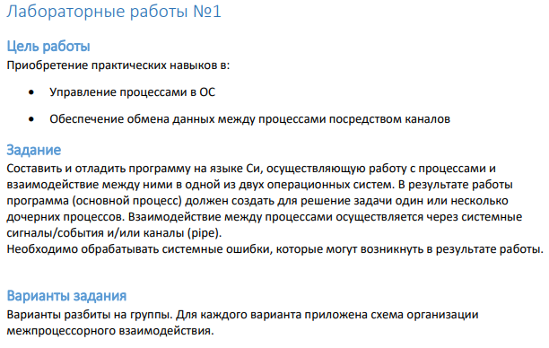
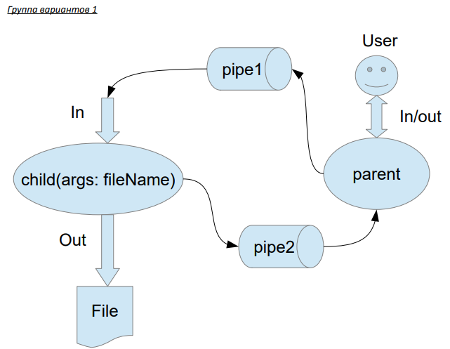

# Задание:
**2 вариант)** Пользователь вводит команды вида: «число число число<endline>». Далее эти числа
передаются от родительского процесса в дочерний. Дочерний процесс считает их сумму и
выводит её в файл. Числа имеют тип float. Количество чисел может быть произвольным.